# AI-Based Notification Priority Manager

An intelligent Android application that classifies incoming notifications into priority levels using a fine-tuned DistilBERT model optimized for mobile deployment.

---

## Overview

Modern smartphones receive a large number of notifications, many of which are irrelevant or low priority. This project aims to solve this problem by using Natural Language Processing (NLP) to automatically classify notifications based on their importance.

The system processes notification text in real time and assigns it a priority level, enabling smarter notification management.

---

## Highlights

- Transformer-based NLP model (DistilBERT)  
- ONNX + Quantization for mobile optimization  
- Real-time on-device notification classification  
- End-to-end pipeline: Training → Optimization → Android Deployment  

---

## Application Screenshots

### Mobile Interface & User Experience

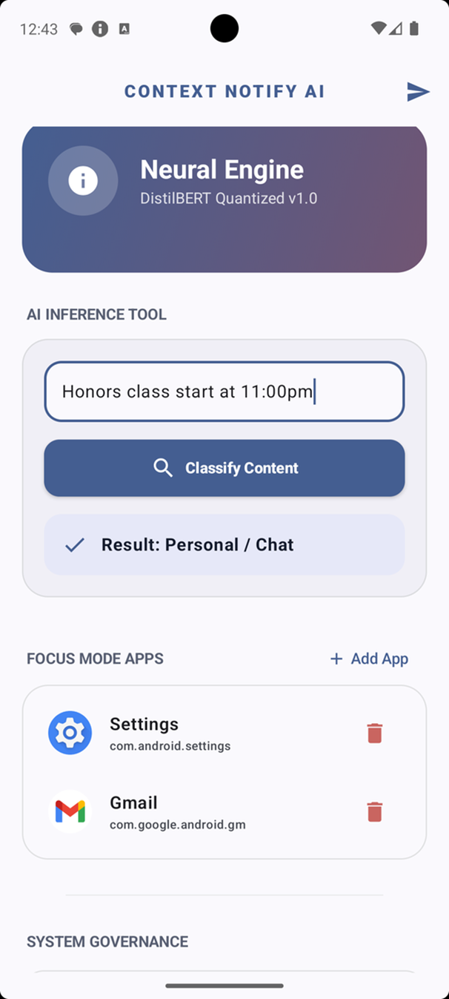
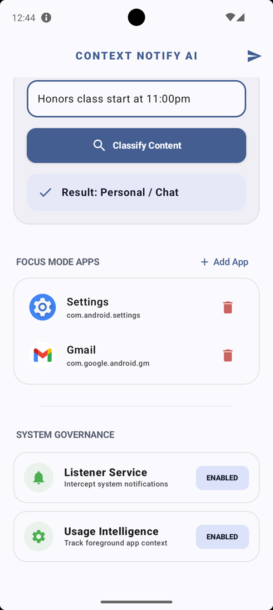
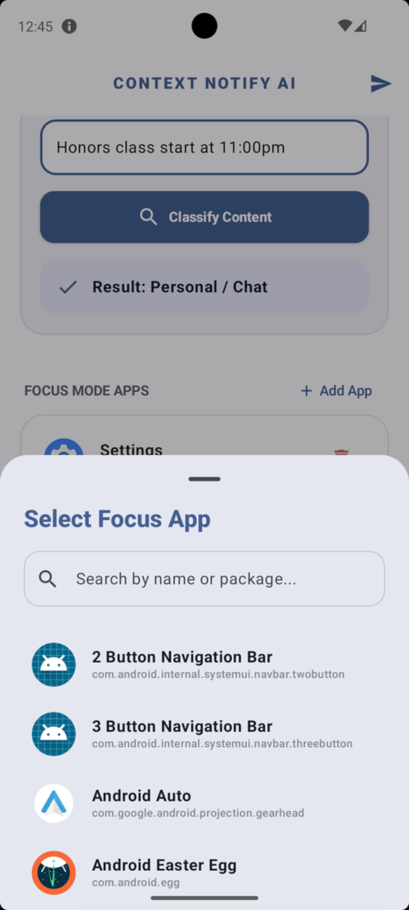

The application provides a clean and intuitive interface for managing notifications. Users can:

- View classified notifications  
- Enable or disable focus mode  
- Select focus applications  
- Monitor system behavior  

---

### System-Level Notification Handling

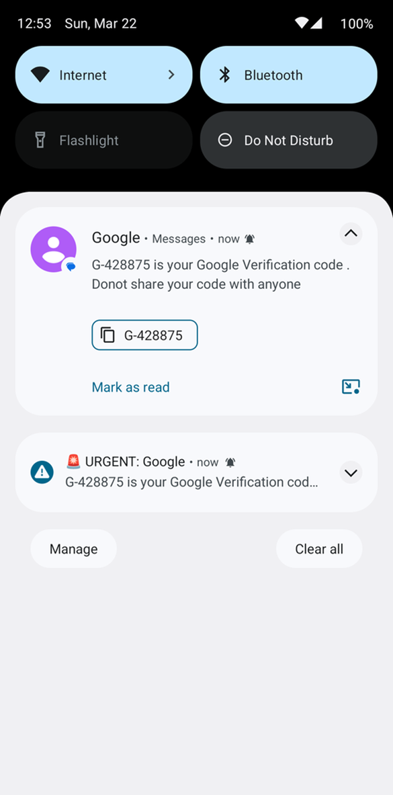
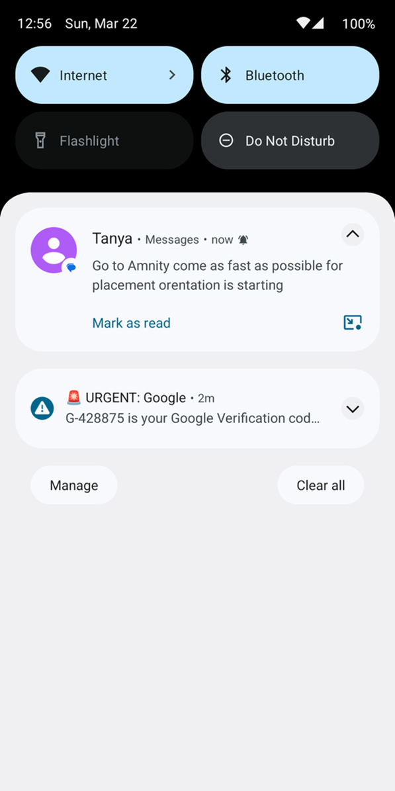

The system captures notifications at the OS level using Android's NotificationListenerService and processes them in real time.

---

## Objectives

- Classify notifications into multiple priority levels  
- Perform on-device inference without relying on cloud APIs  
- Optimize model performance for mobile environments  
- Demonstrate end-to-end integration of AI and Android  

---

## Tech Stack

### Machine Learning
- Python  
- Hugging Face Transformers  
- PyTorch  
- Scikit-learn  

### Model Optimization
- ONNX (Open Neural Network Exchange)  
- Quantization (for size and speed optimization)  

### Android Development
- Java / Kotlin  
- Android Studio  
- ONNX Runtime (Android)  

---

## Dataset and Preprocessing

The dataset was created by combining multiple sources to represent different types of notifications.

### Dataset Overview

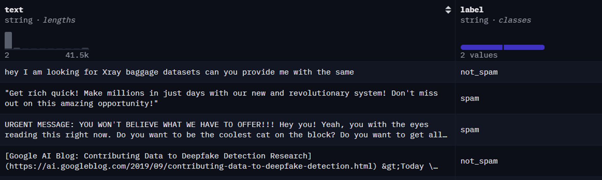
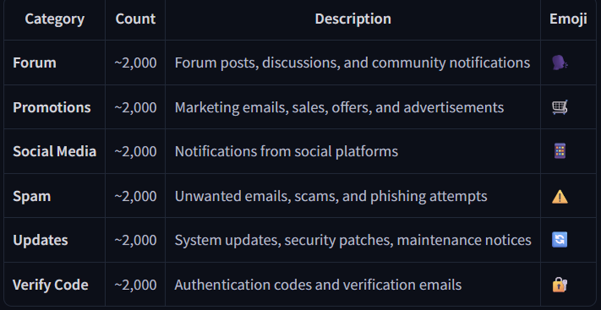

The dataset includes:

- Spam messages  
- Promotional notifications  
- Social media alerts  
- System updates  
- Verification codes  

Each message was labeled with a priority score (0–5).

### Preprocessing Steps

- Text cleaning (removal of noise and special characters)  
- Lowercasing and normalization  
- Tokenization using DistilBERT tokenizer  

### Data Split

- Training: 80%  
- Testing: 20%  

---

## Model Architecture

- DistilBERT (Transformer-based model)

### Why DistilBERT?

- Lightweight version of BERT  
- Faster and more efficient  
- Captures contextual meaning of text  
- Suitable for mobile deployment  

---

## Training Details

- Fine-tuned on combined dataset  
- Loss Function: Cross-Entropy Loss  
- Optimizer: AdamW  
- Evaluation Metric: Accuracy  

### Baseline Model

- Naive Bayes: ~96% accuracy  

---

## Model Optimization

To deploy the model on mobile, the following optimizations were performed:

### ONNX Conversion

- Model converted using `torch.onnx.export()`  
- Enables cross-platform deployment  
- Removes dependency on PyTorch  
- Allows execution using ONNX Runtime  

---

### Quantization

- Reduced precision from float32 to int8  
- Reduces model size and improves speed  
- Lowers memory and computation requirements  
- Maintains high accuracy with minimal loss  

---

### Results

- Model size reduced from **255 MB to 64 MB**  
- Faster inference on mobile devices  
- Maintained high classification accuracy  

---

## System Architecture

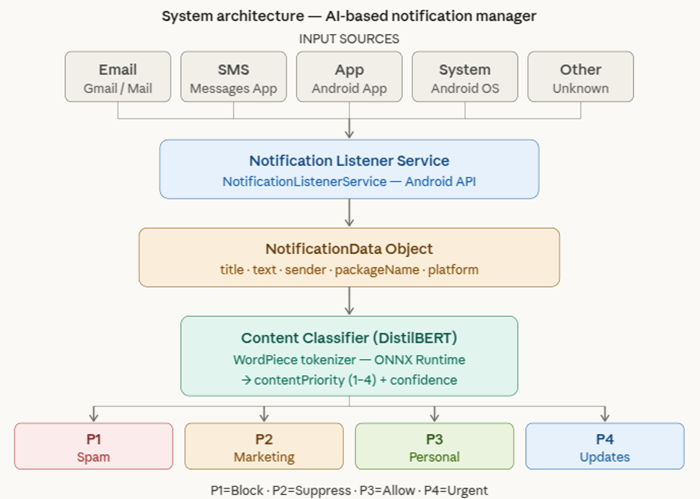

The system consists of:

- Notification Listener → captures notifications  
- Text Processing → prepares input  
- NLP Model → classifies priority  
- Notification Manager → decides action  

---

## Working Pipeline

1. Notification received  
2. Captured by NotificationListener  
3. Text preprocessing and tokenization  
4. Input tensors created  
5. ONNX model inference  
6. Output mapped to priority level  
7. Notification handled accordingly  

---

## Android Integration

### Key Components

**ModelRunner**
- Loads ONNX model  
- Runs inference  

**Tokenizer**
- Converts text to token IDs  
- Uses vocab.txt  

**NotificationListener**
- Captures notifications  
- Sends text for classification  

---

## Testing and Validation

Tested using:

- Hardcoded sample texts  
- Android emulator  
- Real device  

### System Logs and Decision Mapping

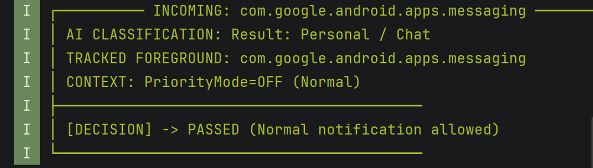
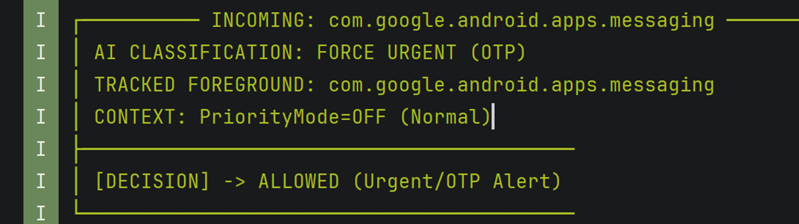
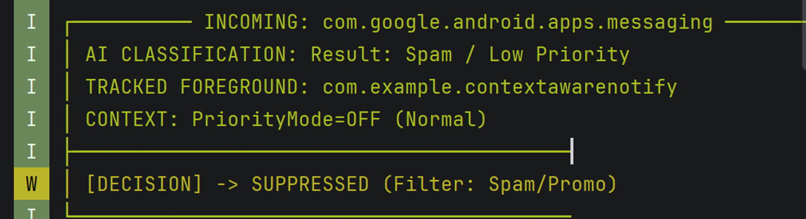
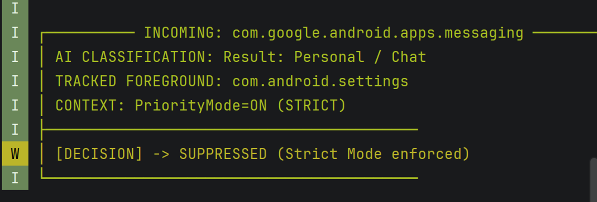
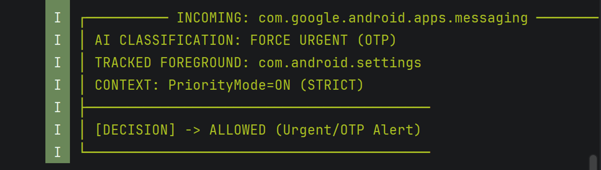

Logs were used to verify:

- Notification capture  
- Classification results  
- Priority assignment  
- Final decision (allowed / delayed / suppressed)  

---

## Key Features

- Real-time notification classification  
- On-device AI (no internet required)  
- Lightweight optimized model  
- Context-aware notification handling  
- End-to-end ML + Android integration  

---

## Project Structure

```
ai-notification-manager/
│
├── model_training.ipynb
├── model_onnx_quantized.ipynb
├── android_app/
│   ├── assets/
│   │   ├── model_quantized.onnx
│   │   ├── vocab.txt
│   │   └── label_map.json
│   ├── ModelRunner.java
│   ├── Tokenizer.java
│   └── NotificationListener.java
├── screenshots/
```

---

## Conclusion

This project demonstrates how transformer-based NLP models can be optimized and deployed on mobile devices to solve real-world problems like notification overload.

